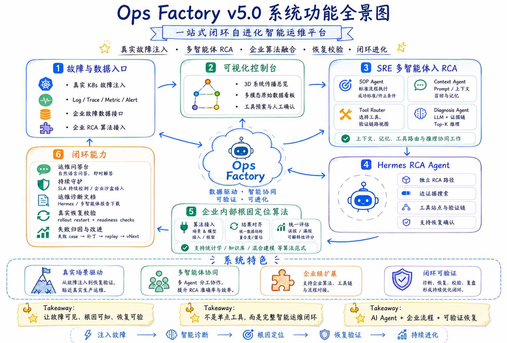
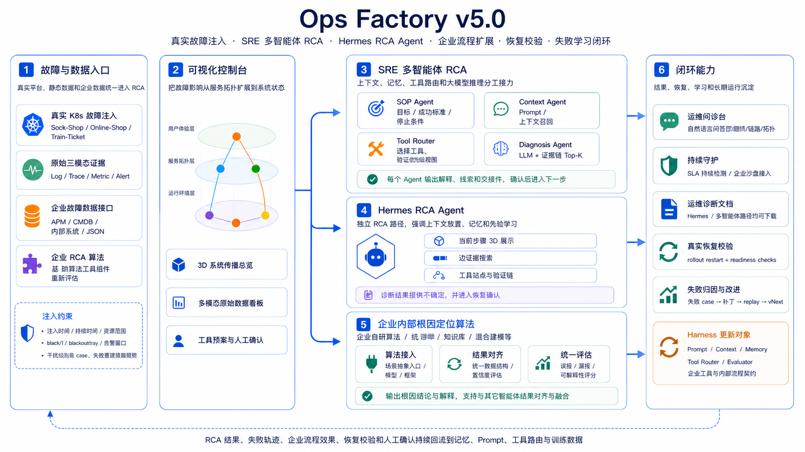

<a id="home"></a>

<p align="center">
  <a href="#home"><strong>首页</strong></a>
  &nbsp;&nbsp;|&nbsp;&nbsp;
  <a href="#demo"><strong>Demo</strong></a>
  &nbsp;&nbsp;|&nbsp;&nbsp;
  <a href="#architecture"><strong>架构</strong></a>
  &nbsp;&nbsp;|&nbsp;&nbsp;
  <a href="#capabilities"><strong>能力</strong></a>
  &nbsp;&nbsp;|&nbsp;&nbsp;
  <a href="#model"><strong>模型边界</strong></a>
  &nbsp;&nbsp;|&nbsp;&nbsp;
  <a href="#deployment"><strong>部署</strong></a>
  &nbsp;&nbsp;|&nbsp;&nbsp;
  <a href="#guide"><strong>使用指南</strong></a>
  &nbsp;&nbsp;|&nbsp;&nbsp;
  <a href="#faq"><strong>FAQ</strong></a>
</p>

<p align="center">
  
  
  
  
</p>

<table>
  <tr>
    <td width="54%">
      <h1>Ops Factory v5.0</h1>
      <h3>一站式闭环自进化智能运维平台</h3>
      <p>
        Ops Factory 把真实故障数据、可观测证据、多智能体 RCA、Hermes RCA Agent、企业算法接入、恢复校验和失败学习放进同一个控制台。
        它是一条从故障进入、证据融合、Agent 推理、恢复验证到 vNext 持续进化的完整链路。
      </p>
      <p>
        <a href="#demo"><strong>观看 Demo</strong></a>
        &nbsp;&nbsp;
        <a href="#architecture"><strong>查看系统全景</strong></a>
        &nbsp;&nbsp;
        <a href="#deployment"><strong>一键启动</strong></a>
      </p>
      <p>
        <code>故障注入</code>
        <code>可观测数据</code>
        <code>智能体</code>
        <code>企业算法融合</code>
        <code>恢复校验</code>
        <code>持续学习</code>
      </p>
    </td>
    <td width="46%">
      
    </td>
  </tr>
</table>

<table>
  <tr>
    <td align="center"><strong>Local-first</strong><br>默认本地 Qwen-0.6B</td>
    <td align="center"><strong>Agentic RCA</strong><br>SOP / Context / Memory / Tool / Diagnosis / Learner</td>
    <td align="center"><strong>Enterprise Ready</strong><br>内部算法、工具链、Runbook 可接入</td>
    <td align="center"><strong>Closed Loop</strong><br>恢复、校验、复盘、vNext 发布</td>
  </tr>
</table>

Ops Factory 默认使用本地 Qwen-0.6B。系统不内置任何外部 API Key，也不会默认调用外部模型。用户如果希望使用自己的模型 API，可以在页面右上角点击 **模型来源**，主动选择 **OpenAI-compatible** 或 **Anthropic-compatible**，并填写自己的 Base URL、模型名和 API Key。不选择就始终使用本地模型。

<a id="demo"></a>

## Demo演示

<table>
  <tr>
    <td width="62%" align="center">
      <a href="https://b23.tv/YEsMhx0" target="_blank">
        
      </a>
      <br/><br/>
      <a href="https://b23.tv/YEsMhx0" target="_blank">
        ▶ 点击播放 Demo 演示视频
      </a>
    </td>
    <td width="38%">
      <h3>Demo演示覆盖完整交付链路</h3>
      <p>
        Demo 从数据入口开始，依次展示可视化控制台、运维问诊台、根因分析包括多智能体工作流和Hermes 自动诊断流程、故障恢复校验、持续守护、故障数据一键收集、模型交互、成效看板其中涉及失败归因与 vNext 发布。
      </p>
    </td>
  </tr>
</table>

<details>
  <summary><strong>Ops Factory 覆盖哪些能力？</strong></summary>

  - 数据平台：Cloud-OpsBench、真实 Kubernetes、企业自定义数据入口。
  - 证据融合：Log、Trace、Metric、Alert、Topology 与工具输出进入统一上下文。
  - 多智能体 RCA：SOP Agent、Context Agent、Memory Agent、Tool Router Agent、Evidence Agent、Diagnosis Agent、Learner Agent。
  - Hermes RCA Agent：自动执行上下文、技能检索、工具路由、证据执行、根因推理、失败学习。
  - 企业算法融合：内部 RCA 流程注册、输入输出契约、统一评估口径。
  - 闭环能力：运维问诊、持续守护、恢复校验、失败归因、Replay 守门、vNext 发布。
</details>

<a id="architecture"></a>

## System Architecture

<p align="center">
  
</p>

<p align="center">
  <strong>真实故障注入 → 证据融合 → Agent RCA → Hermes RCA → 企业算法融合 → 恢复校验 → 失败学习</strong>
</p>

<details open>
  <summary><strong>系统全景说明</strong></summary>

  Ops Factory 以“可见、可查、可验证、可进化”为核心设计原则。左侧负责真实故障与数据入口，中心负责统一控制台和 Agent 协同，右侧负责 RCA、Hermes、恢复与失败学习，底部承接企业扩展和闭环能力。每个阶段都保留输入、输出、证据、模型状态和人工确认点。
</details>

<details>
  <summary><strong>六段式链路</strong></summary>

  | 阶段 | 核心产物 | 用户能看到什么 |
  | --- | --- | --- |
  | 1. 故障与数据入口 | 故障 case、日志、链路、指标、告警、拓扑 | 数据平台、故障注入、企业 JSON / API 接入 |
  | 2. 可视化控制台 | 传播图、工具预案、证据摘要 | 3D 系统总览、多模态数据看板、工具确认 |
  | 3. SRE 多智能体 RCA | Agent 接力轨迹、Top-K 根因候选 | 每个 Agent 的输入、输出、交接契约、模型调用状态 |
  | 4. Hermes RCA Agent | 上下文胶囊、技能检索、工具路由、RCA Reasoner | 自动执行完整流程，逐段展示证据与结果 |
  | 5. 企业内部根因算法 | 内部流程、模型、Runbook、评分结果 | 算法接入、结果对齐、统一评估 |
  | 6. 闭环能力 | 恢复报告、守护计划、失败补丁、vNext | 恢复校验、问诊、持续守护、失败归因与发布 |
</details>

<a id="capabilities"></a>

## Capabilities

<table>
  <tr>
    <td><strong>故障数据入口</strong><br>真实 K8s 注入、Cloud-OpsBench、企业数据接口、企业 RCA 算法注册。</td>
    <td><strong>多模态证据融合</strong><br>Log / Trace / Metric / Alert / Topology / Tool output 进入统一上下文。</td>
    <td><strong>多智能体 RCA</strong><br>七类 Agent 接力执行，保留每一步输入、输出、交接和模型状态。</td>
  </tr>
  <tr>
    <td><strong>Hermes RCA Agent</strong><br>上下文胶囊、记忆、技能检索、工具路由和 RCA Reasoner 自动跑完整流程。</td>
    <td><strong>企业算法融合</strong><br>支持内部算法、知识库、混合建模、MCP 工具和已有诊断流水线。</td>
    <td><strong>闭环进化</strong><br>恢复校验、失败 case 归因、Replay 守门、Harness vNext 发布。</td>
  </tr>
</table>

<details>
  <summary><strong>多智能体 RCA 具体怎么跑？</strong></summary>

  1. **SOP Agent** 定义 RCA 目标、成功标准、停止条件和人工确认点。
  2. **Context Agent** 压缩日志、链路、指标、告警和拓扑，只保留高信号上下文。
  3. **Memory Agent** 检索成功策略和失败反例，避免重复误判。
  4. **Tool Router Agent** 根据数据模态、历史收益和上下文预算选择工具。
  5. **Evidence Agent** 执行工具并生成 before / after 证据交接件。
  6. **Diagnosis Agent** 调用当前模型，默认本地 Qwen-0.6B，输出 Top-K 根因候选。
  7. **Learner Agent** 计算 ACC@K / MRR，把失败转为下一轮 Prompt、Memory、Tool Router、Context、SOP 或 Evaluator 补丁。
</details>

<details>
  <summary><strong>Hermes RCA Agent 具体展示什么？</strong></summary>

  Hermes 点击执行后会自动跑完整流程，并逐段展开：

  - Hermes 上下文引擎。
  - SkillClaw 技能检索。
  - Hermes 工具路由。
  - 工具执行与证据链。
  - Hermes RCA Reasoner。
  - SkillClaw 失败学习。

  结果区会显示模型是否已调用、是否规则补齐、候选根因、ACC@K、MRR、失败学习补丁和下一轮策略。
</details>

<details>
  <summary><strong>企业内部算法如何接入？</strong></summary>

  企业可以把已有 RCA 算法、Runbook、图算法、知识库、MCP 工具或内部诊断流水线注册成流程。Ops Factory 会记录流程名称、输入模态、输出契约、触发条件和评估口径。未接入真实算法前，页面只展示流程注册和契约，不伪造“企业算法结果”。
</details>

<details>
  <summary><strong>失败归因与 vNext 发布真的做了什么？</strong></summary>

  - 读取历史 RCA 中 ACC@1 未命中的失败 case。
  - 解释为什么错：上下文缺失、工具选择偏差、Prompt 偏置、服务别名、评估重排等。
  - 生成补丁：Memory、Prompt、Tool Router、Context Builder、SOP、Evaluator。
  - 用历史 case 做离线 Replay，检查收益和回归风险。
  - 通过守门后写入 `SRE/data/evolution/agent_state.json`，下一次 RCA 自动读取。
</details>

<a id="model"></a>

## Model Boundary

<table>
  <tr>
    <td width="50%">
      <h3>默认：本地 Qwen-0.6B</h3>
      <p>系统默认模型是 <code>Qwen/Qwen3-0.6B</code>，监听 <code>http://127.0.0.1:8000/v1</code>。所有需要大模型的地方默认都走本地模型，包括模型交互、多智能体 RCA、Hermes RCA、运维问诊和失败学习分析。</p>
    </td>
    <td width="50%">
      <h3>可选：用户自带 API</h3>
      <p>Ops Factory 不提供外部 API，不内置第三方 Key。用户可在页面中主动选择 OpenAI-compatible 或 Anthropic-compatible，并填写自己的 Base URL、模型名和 API Key。</p>
    </td>
  </tr>
</table>

默认配置位于 [SRE/configs/config.yaml](SRE/configs/config.yaml)：

```yaml
llm:
  provider: "${LLM_PROVIDER:local}"
  api_key: "${LLM_API_KEY:}"
  base_url: "${LLM_BASE_URL:http://127.0.0.1:8000/v1}"
  model: "${LLM_MODEL:Qwen/Qwen3-0.6B}"
  max_tokens: 8192
  timeout: 120
```

<details>
  <summary><strong>页面里如何选择自己的 API？</strong></summary>

  1. 打开 Dashboard。
  2. 点击右上角 **模型来源**。
  3. 选择 **用户自带 OpenAI-compatible API** 或 **用户自带 Anthropic-compatible API**。
  4. 填写自己的 Base URL、模型名称、API Key。
  5. 点击 **保存并应用**。

  安全边界：

  | 边界 | 行为 |
  | --- | --- |
  | 用户不选择 API | 始终使用本地 Qwen-0.6B。 |
  | 用户选择 API | 只使用用户自己填写的 API。 |
  | API Key 存储 | 不写入仓库文件，不写入 `.env`，只在当前服务进程内使用。 |
  | 服务重启 | 默认恢复本地 Qwen-0.6B，除非用户自行设置环境变量。 |
</details>

<details>
  <summary><strong>如何用环境变量接入 API？</strong></summary>

  OpenAI-compatible：

  ```bash
  export LLM_PROVIDER=openai_compatible
  export LLM_BASE_URL=https://your-endpoint.example/v1
  export LLM_MODEL=your-model
  export LLM_API_KEY=your-own-key
  bash start_opsfactory.sh --host 127.0.0.1 --port 8080
  ```

  Anthropic-compatible：

  ```bash
  export LLM_PROVIDER=anthropic
  export LLM_BASE_URL=https://api.anthropic.com/v1
  export LLM_MODEL=your-anthropic-model
  export LLM_API_KEY=your-own-key
  bash start_opsfactory.sh --host 127.0.0.1 --port 8080
  ```
</details>

<a id="deployment"></a>

## Deployment

### Quick Start

```bash
cd /path/to/OpsFactory
bash setup_opsfactory_env.sh
bash start_opsfactory.sh --host 127.0.0.1 --port 8080
```

打开浏览器：

```text
http://127.0.0.1:8080
```

<details open>
  <summary><strong>一键部署</strong></summary>

  直接执行：

  ```bash
  bash setup_opsfactory_env.sh
  ```

  脚本会自动完成：

  1. 检查 Python 3.10+。
  2. 如果没有合适 Python，下载并安装私有 Miniforge Python 到 `.opsfactory/python`。
  3. 创建项目虚拟环境 `.venv`。
  4. 安装 Dashboard、Kubernetes 客户端、FastAPI、Transformers、Torch、本地模型服务、模型下载工具等依赖。
  5. 检查 `models/Qwen/Qwen3-0.6B`。如果模型文件缺失，会下载本地 Qwen-0.6B。
  6. 下载本地 `kubectl` 和 `kind` 到 `.opsfactory/bin`。
  7. 生成 `.opsfactory/env.sh` 和 `SRE/.env`。
</details>

<details>
  <summary><strong>一键启动、后台启动、重启、停止</strong></summary>

  ```bash
  # 前台启动
  bash start_opsfactory.sh --host 127.0.0.1 --port 8080

  # 后台启动
  bash start_opsfactory.sh --background --host 127.0.0.1 --port 8080

  # 回收旧进程并重启
  bash start_opsfactory.sh --restart --host 127.0.0.1 --port 8080

  # 停止后台服务
  bash start_opsfactory.sh --stop --port 8080
  ```

  在会自动回收后台进程的桌面沙箱或远程开发环境中，推荐：

  ```bash
  bash start_opsfactory.sh --tmux --restart --port 8080
  ```
</details>

<details>
  <summary><strong>部署模式</strong></summary>

  Local Demo：

  ```bash
  bash setup_opsfactory_env.sh
  bash start_opsfactory.sh --host 127.0.0.1 --port 8080
  ```

  LAN Demo：

  ```bash
  bash start_opsfactory.sh --host 0.0.0.0 --port 8080
  ```

  Existing Kubernetes Cluster：

  ```bash
  export KUBECONFIG=/path/to/kubeconfig
  export OPSFACTORY_SOCK_SHOP_NAMESPACE=sock-shop
  export OPSFACTORY_ONLINE_SHOPPING_NAMESPACE=online-shopping
  export OPSFACTORY_TRAIN_TICKET_NAMESPACE=train-ticket
  bash start_opsfactory.sh --host 0.0.0.0 --port 8080
  ```

  Local Kind Cluster：

  ```bash
  bash setup_opsfactory_env.sh --with-kind --bootstrap-platforms
  bash start_opsfactory.sh --restart --port 8080
  ```

  Full Research Stack：

  ```bash
  bash setup_opsfactory_env.sh --full
  ```
</details>

<a id="guide"></a>

## Product Guide

<details open>
  <summary><strong>1. 数据平台</strong></summary>

  数据平台是所有 RCA 的入口。它支持 Cloud-OpsBench 离线案例、真实 Kubernetes 故障注入、企业/自定义故障 JSON 数据，以及企业 RCA 算法流程注册。选择 case 后，系统会展示拓扑、日志、链路、指标、告警和工具预案。
</details>

<details>
  <summary><strong>2. 运维问诊台</strong></summary>

  问诊台会绑定当前故障 case。用户可以直接问“最异常的服务是什么”“这个错误是不是根因”“恢复前需要检查什么”。系统会按日志、指标、链路、拓扑和工具证据组织回答，适合不同层级的运维人员同时使用。
</details>

<details>
  <summary><strong>3. 根因分析中心</strong></summary>

  根因分析中心提供三条路径：

  | 路径 | 说明 |
  | --- | --- |
  | 多智能体 RCA | Agent 接力执行，展示每一步输入、输出、模型调用状态和候选根因。 |
  | Hermes RCA Agent | 一次点击自动跑完整流程，逐段展示上下文、技能、工具、Reasoner 和学习结果。 |
  | 企业 RCA 流程 | 接入内部算法、Runbook、图算法、知识库和 MCP 工具。 |
</details>

<details>
  <summary><strong>4. RCA 结果与报告</strong></summary>

  结果页会展示模型是否真实使用、当前模型来源、Top-K 根因候选、ACC@1 / ACC@3 / ACC@5 / ACC@10、MRR、Ground Truth、工具状态、给模型的原始故障摘要、PDF 运维诊断报告和恢复入口。
</details>

<details>
  <summary><strong>5. 恢复校验</strong></summary>

  恢复不是只更新 UI。系统会根据故障类型执行真实回查，例如 Deployment rollout、ready / available、annotation 清理、tc / iptables 副作用清理等。前端只有在 `actual_cluster_recovery=true` 且 `restore_verified=true` 时才展示恢复成功。
</details>

<details>
  <summary><strong>6. 模型交互</strong></summary>

  模型交互台用于解释最近 RCA、质疑根因候选、复盘工具链、总结失败样本、生成下一轮 Prompt 补丁、生成 Kubernetes 排查计划和解释拓扑影响。默认走本地 Qwen-0.6B；如需更强模型，用户可主动配置自己的 API。
</details>

<details>
  <summary><strong>7. 持续守护</strong></summary>

  持续守护把巡检、风险观察和 RCA 预热做成可确认计划。它支持真实企业系统接入、内置可观测模拟系统、智能巡检沙盘、15 类模拟风险场景、只读巡检、风险归因、处置建议、报告沉淀和高风险人工确认门。
</details>

<details>
  <summary><strong>8. 故障数据收集</strong></summary>

  故障数据收集用于持续生成 SFT / Alpaca 样本、RL / Preference 样本、评估样本、企业复盘样本和自定义格式 JSON。配置项包括平台、训练格式、每个平台轮数、故障持续秒数、观测窗口秒数、采样间隔秒数和自定义模板。
</details>

<details>
  <summary><strong>9. 成效看板</strong></summary>

  成效看板用于判断系统是否真的变好。它展示累计运行次数、成功率、平均 MRR、LLM 使用率、成功率趋势、成功经验、最近失败案例、失败归因与改进、Prompt / Harness 补丁、离线 Replay 守门和 Harness vNext 发布记录。
</details>

## Project Structure

```text
OpsFactory/
├── .gitignore
├── README.md
├── architecture.png
├── demo.mp4
├── requirements-unified.txt
├── setup_opsfactory_env.sh
├── start_opsfactory.sh
├── docs/
│   └── assets/
│       └── outline.png
├── scripts/
│   ├── create_demo.py
│   ├── download_qwen3_0_6b.sh
│   ├── run_ops_factory_dashboard.sh
│   ├── setup_env.sh
│   ├── setup_opsfactory_env.sh
│   ├── start_ops_factory_all.sh
│   ├── start_opsfactory.sh
│   └── start_qwen_local_server.sh
├── SRE/
│   ├── agents/
│   ├── configs/
│   ├── data/
│   ├── deploy/
│   ├── doc/
│   ├── eval/
│   ├── integrations/
│   ├── memory/
│   ├── observability/
│   ├── orchestrator/
│   ├── paradigms/
│   ├── tools/
│   ├── vendor/
│   │   ├── SkillClaw/
│   │   ├── hermes-agent/
│   │   └── langchain/
│   ├── web_app/
│   ├── Dockerfile
│   ├── docker-compose.yaml
│   ├── local_model_server.py
│   ├── main.py
│   ├── mcp_server.py
│   └── requirements.txt
├── Cloud-OpsBench/
├── OpsAug/
├── PromCopilot/
└── models/
    └── Qwen/
        └── Qwen3-0.6B/
```

## Acknowledgments

We would like to express our special thanks to the codes of these papers or repositories:

- [Cloud-OpsBench](https://github.com/LLM4Ops/Cloud-OpsBench)
- [Sock Shop](https://github.com/microservices-demo/microservices-demo)
- [Online-Shop / GCP Microservices Demo](https://github.com/ballerina-guides/gcp-microservices-demo)
- [Train-Ticket](https://github.com/FudanSELab/serverless-trainticket)
- [OpsAug](https://github.com/ROY-DOU/OpsAug)
- [DrainMCP](https://github.com/NickLennonLiu/drain_mcp)
- [KPIFailure](https://github.com/aichicaideyang/KPIFailure)
- [Dynamic-Evolutionary-System](https://github.com/ningshi01/Dynamic-Evolutionary-System)
- [OpsKB](https://github.com/FudanSELab/OpsKb)
- [PromCopilot](https://github.com/FudanSELab/PromCopilot)
- [Qwen/Qwen3-0.6B](https://modelscope.cn/models/Qwen/Qwen3-0.6B)
- [LangChain](https://github.com/langchain-ai/langchain)
- [Hermes-Agent](https://github.com/NousResearch/hermes-agent)
- [SkillClaw](https://github.com/AMAP-ML/SkillClaw)
- [AgenticSRE](https://github.com/IntelligentDDS/AgenticSRE)
- [Chart.js](https://github.com/chartjs/Chart.js)
- [Three.js](https://github.com/mrdoob/three.js)
- [FastAPI](https://github.com/fastapi/fastapi)
- [Uvicorn](https://github.com/encode/uvicorn)
- [Pydantic](https://github.com/pydantic/pydantic)
- [Model Context Protocol Python SDK](https://github.com/modelcontextprotocol/python-sdk)
- [Transformers](https://github.com/huggingface/transformers)
- [PyTorch](https://github.com/pytorch/pytorch)
- [ModelScope](https://github.com/modelscope/modelscope)
- [Kubernetes Python Client](https://github.com/kubernetes-client/python)
- [ChromaDB](https://github.com/chroma-core/chroma)
- [Drain3](https://github.com/logpai/Drain3)
- [NumPy](https://github.com/numpy/numpy)
- [Pandas](https://github.com/pandas-dev/pandas)
- [scikit-learn](https://github.com/scikit-learn/scikit-learn)
- [DGL](https://github.com/dmlc/dgl)
- [NetworkX](https://github.com/networkx/networkx)


## FAQ

<details open>
  <summary><strong>首页显示 Internal Server Error 怎么办？</strong></summary>

  ```bash
  bash start_opsfactory.sh --host 127.0.0.1 --port 8080 --background --restart
  tail -n 120 SRE/logs/opsfactory-8080.log
  ```

  如果刚改过项目文件夹名字，建议使用 `--restart`，避免旧进程仍从旧路径工作。
</details>

<details>
  <summary><strong>端口被占用怎么办？</strong></summary>

  ```bash
  bash start_opsfactory.sh --restart --port 8080
  ```

  或换端口：

  ```bash
  bash start_opsfactory.sh --port 18080
  ```
</details>

<details>
  <summary><strong>本地模型首次加载慢怎么办？</strong></summary>

  Qwen-0.6B 首次加载需要几十秒。可以打开 **模型交互** 页面点击启动本地模型，也可以手动执行：

  ```bash
  bash scripts/start_qwen_local_server.sh
  ```
</details>

<details>
  <summary><strong>模型文件缺失怎么办？</strong></summary>

  ```bash
  bash scripts/download_qwen3_0_6b.sh
  ```

  或重新执行：

  ```bash
  bash setup_opsfactory_env.sh
  ```
</details>
